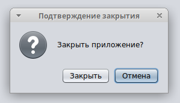

# Robots
The project to learn OO design concepts and MDI application development in Java

Скриншоты для второго задания:

После chmod 000 на файл конфига:

После truncate -s 30 на файл конфига:

Скриншоты для первого задания:

